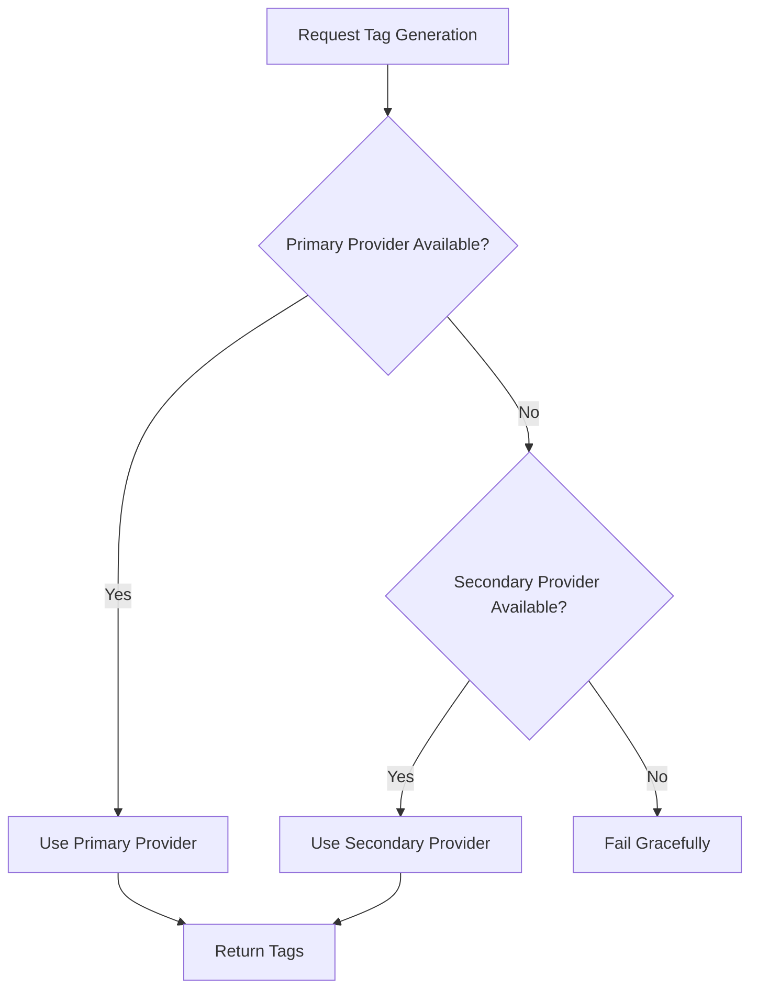

# Developer Guide: Adding Tagging Providers

This document explains how to add new tagging providers to the Anotter Tagger plugin and describes the architecture's approach to data management.

## Architecture Overview

The plugin uses a modular, provider-based architecture. The core logic is orchestrated by the `TagManager`, which delegates the actual tag generation to various implementations of the `TaggerProvider` interface.

### The `TaggerProvider` Interface

All providers must implement the interface defined in `src/core/Types.ts`:

```typescript
export interface TaggerProvider {
	/** Unique identifier for the provider (e.g., 'tfidf', 'ollama') */
	id: string;

	/** Display name used in settings and UI */
	name: string;

	/**
	 * Checks if the provider is currently available (e.g., service is reachable).
	 * TagManager uses this to decide whether to fall back to a secondary provider.
	 */
	isAvailable(): Promise<boolean>;

	/**
	 * Generates a list of tags for a single file.
	 * Should return null or an empty array if generation fails or is skipped.
	 */
	generateTags(file: TFile): Promise<string[] | null>;

	/**
	 * Optional: Process a batch of files.
	 * Useful if the provider can optimize multi-file processing (e.g., rate limiting).
	 */
	batchGenerateTags?(files: TFile[]): Promise<void>;

	/**
	 * Optional: Rebuilds internal state/index.
	 * Crucial for providers that require global vault context (like TF-IDF).
	 */
	rebuild?(silent?: boolean): Promise<void>;
}
```

## How to Add a New Provider

### 1. Create the Provider Class

Create a new directory under `src/providers/` for your provider. Inside, create a class that implements `TaggerProvider`.

```typescript
// src/providers/my-new-provider/MyProvider.ts
import { TFile } from "obsidian";
import { TaggerProvider } from "../../core/Types";

export class MyProvider implements TaggerProvider {
	id = "my-new-provider";
	name = "My New Tagger";

	async generateTags(file: TFile): Promise<string[] | null> {
		// Your logic here
		return ["tag1", "tag2"];
	}

	async isAvailable(): Promise<boolean> {
		// Check if service/api is reachable
		return true;
	}
}
```

### 2. Update Settings

Add any configuration options your provider needs to `src/settings.ts`. If it is a provider that can be selected, it will automatically be available in the **Primary Provider** and **Secondary Provider** dropdowns.

The main settings for provider selection are:

- `primaryProvider`: The ID of the preferred provider.
- `secondaryProvider`: The ID of the fallback provider.

```typescript
export interface AnotterTaggerSettings {
	primaryProvider: string;
	secondaryProvider: string;
	// ... provider specific settings
}
```

### 3. Register the Provider

In `src/main.ts`, initialize your provider and register it with the `TagManager`.

```typescript
// src/main.ts
import { MyProvider } from "./providers/my-new-provider/MyProvider";

// inside onload()
const myProvider = new MyProvider();
this.tagManager.registerProvider(myProvider);
```

### 4. Add Settings UI

Update `src/ui/SettingTab.ts` to include configuration controls for your new provider.

## Provider Fallback System

The `TagManager` utilizes a primary and secondary provider system to ensure tagging remains functional even if one service is unavailable (e.g., a local Ollama instance is not running).

### 1. Availability Check

Before using a provider, the `TagManager` calls its `isAvailable()` method.

- If `primaryProvider.isAvailable()` returns `true`, it is used.
- If it returns `false`, `TagManager` falls back to the `secondaryProvider`.

### 2. Configuration

Users select their preferred providers in the settings. These are stored in `primaryProvider` and `secondaryProvider` as provider IDs.

### 3. Execution Flow



## Data Management & Context

Different tagging algorithms require different levels of access to vault data. Our architecture supports two primary patterns:

### Local Context Providers (e.g., Ollama)

Providers like Ollama operate on a **per-file basis**.

- **Data Access**: They typically only read the content of the `TFile` passed to `generateTags`.
- **State**: They are mostly stateless. Each request is independent.
- **Optimization**: These providers benefit from concurrency limits or batching to avoid overwhelming external APIs.

### Global Context Providers (e.g., TF-IDF)

Providers like TF-IDF require **vault-wide knowledge** to be effective.

- **Data Access**: To calculate "Inverse Document Frequency", the provider must know how many documents in the entire vault contain a specific word.
- **State**: These providers maintain an internal index or model representing the entire vault.
- **Management**:
    - They should use the `rebuild()` method to scan the vault and update their internal index.
    - They often listen to vault events (like file creation/deletion) to keep their model up-to-date.
    - The `TfidfProvider` implementation specifically scans all markdown files using `this.app.vault.getMarkdownFiles()` during its initialization or rebuild phase.

### Best Practices for Data Management

- **Efficiency**: Avoid re-scanning the entire vault inside `generateTags`. Use `rebuild()` for heavy indexing and store the results in memory.
- **Privacy**: Only read the content necessary for tagging.
- **Cleanup**: If your provider registers event listeners on the vault, ensure they are cleaned up or managed via `this.registerEvent` if the provider has access to the plugin instance.
